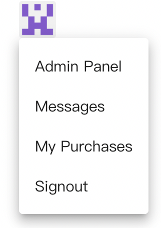

# 如何查看购买的商品

您可以通过以下三种方式查看已购买的商品：

1 在商品页面的“付费内容”这里

<figure><figcaption></figcaption></figure>

2 右上角的个人头像，鼠标悬浮时会显示菜单。您也可以点击此处直接访问“[我的购买](https://stallee.com/panel/purchases)”页面。

<figure><figcaption></figcaption></figure>

3 如果您的账号填写了邮箱，系统会向您发送一封包含购买商品的邮件。
